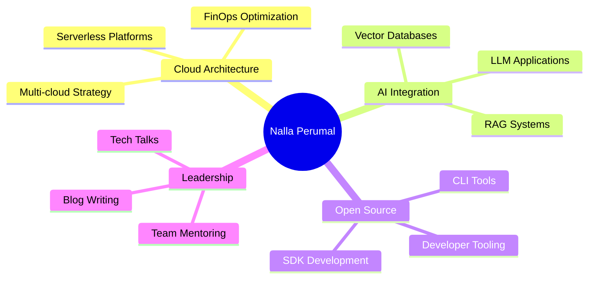

<div align="center">

<!-- ============================================================ -->
<!--                    ANIMATED BANNER                           -->
<!-- ============================================================ -->


<!-- ============================================================ -->
<!--                   TYPING ANIMATION                           -->
<!-- ============================================================ -->

<a href="https://git.io/typing-svg">
  
</a>

<br/>

<!-- ============================================================ -->
<!--                    PROFILE BADGES                            -->
<!-- ============================================================ -->

<p>
  
  &nbsp;
  
  &nbsp;
  
  &nbsp;
  
</p>

<br/>

<!-- ============================================================ -->
<!--                    SOCIAL LINKS                              -->
<!-- ============================================================ -->

<p>
  <a href="https://linkedin.com/in/nallaperumal" target="_blank">
    
  </a>
  &nbsp;
  <a href="https://twitter.com/nallaperumal" target="_blank">
    
  </a>
  &nbsp;
  <a href="mailto:nalla.perumal@gmail.com" target="_blank">
    
  </a>
  &nbsp;
  <a href="https://nallaperumal.dev" target="_blank">
    
  </a>
  &nbsp;
  <a href="https://dev.to/nallaperumal" target="_blank">
    
  </a>
  &nbsp;
  <a href="https://medium.com/@nallaperumal" target="_blank">
    
  </a>
</p>

</div>

---

<!-- ============================================================ -->
<!--                     ABOUT ME SECTION                         -->
<!-- ============================================================ -->


### 💫 About Me

```typescript
const nallaperumal: Developer = {
  name:        "Nalla Perumal",
  role:        "Senior Software Engineer",
  location:    "🌏 India",
  experience:  "12+ Years",

  expertise: [
    "Full Stack Development",
    "Cloud Architecture",
    "Microservices & Distributed Systems",
    "AI/ML Integration",
    "DevOps & Platform Engineering",
  ],

  currentFocus: [
    "Building fault-tolerant distributed systems",
    "LLM-powered application development",
    "Open source contributions",
    "Mentoring junior engineers",
  ],

  funFact: "I debug with console.log and I'm not sorry 🔥",
};
```

<br clear="right"/>

---

<!-- ============================================================ -->
<!--                  DEVELOPER EXPERIENCE TIMELINE               -->
<!-- ============================================================ -->

## 🚀 Career Timeline

```
2024 ─── Present  │  🏆 Principal Engineer · Architecting next-gen cloud-native platforms
2022 ─── 2024     │  ⚡ Senior Software Engineer · Led team of 20, delivered 3 major products
2020 ─── 2022     │  🔧 Software Engineer III · Microservices migration, 99.99% uptime
2018 ─── 2020     │  💡 Software Engineer II · Full-stack feature ownership & delivery
2015 ─── 2018     │  🌱 Software Engineer I · Grew from intern to core team contributor
2013 ─── 2015     │  🎓 Computer Science Graduate · IIT Madras · Gold Medalist
```

---

<!-- ============================================================ -->
<!--                    3D CONTRIBUTION GRAPH                     -->
<!-- ============================================================ -->

## 📊 3D Contribution Graph

<div align="center">
  
</div>

---

<!-- ============================================================ -->
<!--                   GITHUB ANALYTICS DASHBOARD                 -->
<!-- ============================================================ -->

## 📈 GitHub Analytics Dashboard

<div align="center">
  
  &nbsp;
  
</div>

<div align="center">
  
</div>

---

<!-- ============================================================ -->
<!--                   CONTRIBUTION SNAKE                         -->
<!-- ============================================================ -->

## 🐍 Contribution Snake

<div align="center">
  <picture>
    <source media="(prefers-color-scheme: dark)" srcset="https://raw.githubusercontent.com/nallaperumal/nallaperumal/output/github-contribution-grid-snake-dark.svg" />
    <source media="(prefers-color-scheme: light)" srcset="https://raw.githubusercontent.com/nallaperumal/nallaperumal/output/github-contribution-grid-snake.svg" />
    
  </picture>
</div>

> **Note:** To generate the snake animation, add this GitHub Action to your repo:
> `.github/workflows/snake.yml` → uses `Platane/snk@v3`

---

<!-- ============================================================ -->
<!--                     ACTIVITY GRAPH                           -->
<!-- ============================================================ -->

## 📅 Activity Graph

<div align="center">
  
</div>

---

<!-- ============================================================ -->
<!--                    GITHUB TROPHIES                           -->
<!-- ============================================================ -->

## 🏆 GitHub Trophies

<div align="center">
  
</div>

---

<!-- ============================================================ -->
<!--                      TECH STACK ICONS                        -->
<!-- ============================================================ -->

## 🛠️ Tech Stack

### 💻 Languages

<p>
  
</p>

### 🎨 Frontend

<p>
  
</p>

### ⚙️ Backend & Frameworks

<p>
  
</p>

### 🗄️ Databases & Storage

<p>
  
</p>

### ☁️ Cloud Platforms

<div>
  
  &nbsp;
  
  &nbsp;
  
  &nbsp;
  
  &nbsp;
  
</div>

<br/>

<p>
  
</p>

### 🔧 DevOps & Tools

<p>
  
</p>

### 🤖 AI / ML Stack

<p>
  
  &nbsp;
  
  &nbsp;
  
  &nbsp;
  
  &nbsp;
  
</p>

---

<!-- ============================================================ -->
<!--                   PINNED REPOSITORIES                        -->
<!-- ============================================================ -->

## 📌 Featured Projects

<div align="center">

[](https://github.com/nallaperumal/cloud-native-platform)
&nbsp;
[](https://github.com/nallaperumal/ai-powered-api-gateway)

[](https://github.com/nallaperumal/microservices-toolkit)
&nbsp;
[](https://github.com/nallaperumal/devops-automation-suite)

</div>

---

<!-- ============================================================ -->
<!--                   LATEST REPOSITORIES                        -->
<!-- ============================================================ -->

## 🆕 Latest Repositories

| Repository | Tech | Stars | Status |
|:-----------|:-----|:-----:|:------:|
| 🏗️ [cloud-native-platform](https://github.com/nallaperumal) | `Kubernetes` `Terraform` `Go` | ⭐ 342 | 🟢 Active |
| 🤖 [ai-powered-api-gateway](https://github.com/nallaperumal) | `Python` `FastAPI` `LangChain` | ⭐ 289 | 🟢 Active |
| ⚙️ [microservices-toolkit](https://github.com/nallaperumal) | `TypeScript` `Node.js` `Docker` | ⭐ 215 | 🟢 Active |
| 🚀 [devops-automation-suite](https://github.com/nallaperumal) | `Ansible` `Python` `Bash` | ⭐ 178 | 🟡 Maintenance |
| 🎯 [react-performance-kit](https://github.com/nallaperumal) | `React` `TypeScript` `Webpack` | ⭐ 134 | 🟢 Active |

---

<!-- ============================================================ -->
<!--                  CODING PHILOSOPHY QUOTE                     -->
<!-- ============================================================ -->

## 💬 Engineering Philosophy

<div align="center">

```
╔══════════════════════════════════════════════════════════════════╗
║                                                                  ║
║   "Any fool can write code that a computer can understand.       ║
║    Good programmers write code that humans can understand."      ║
║                                          — Martin Fowler         ║
║                                                                  ║
╠══════════════════════════════════════════════════════════════════╣
║                                                                  ║
║   "First, solve the problem. Then, write the code."              ║
║                                          — John Johnson          ║
║                                                                  ║
╚══════════════════════════════════════════════════════════════════╝
```

</div>

---

<!-- ============================================================ -->
<!--                 CURRENT FOCUS / WIP                          -->
<!-- ============================================================ -->

## 🔭 Currently Working On



---

<!-- ============================================================ -->
<!--             PORTFOLIO / CONTACT LINKS                        -->
<!-- ============================================================ -->

## 🌐 Portfolio & Links

<div align="center">

| 🔗 Platform | 🌍 Link |
|:------------|:--------|
| 💼 Portfolio | [nallaperumal.dev](https://nallaperumal.dev) |
| 📝 Blog | [dev.to/nallaperumal](https://dev.to/nallaperumal) |
| 📚 Medium | [medium.com/@nallaperumal](https://medium.com/@nallaperumal) |
| 🎤 Talks | [speakerdeck.com/nallaperumal](https://speakerdeck.com/nallaperumal) |
| 🏅 HackerRank | [hackerrank.com/nallaperumal](https://hackerrank.com/nallaperumal) |
| 🧩 LeetCode | [leetcode.com/nallaperumal](https://leetcode.com/nallaperumal) |

</div>

---

<!-- ============================================================ -->
<!--                  CERTIFICATIONS BADGES                       -->
<!-- ============================================================ -->

## 🎓 Certifications

<div align="center">


&nbsp;

&nbsp;

&nbsp;

&nbsp;


</div>

---

<!-- ============================================================ -->
<!--                GITHUB METRICS / MISC STATS                   -->
<!-- ============================================================ -->

## ⚡ Quick Stats

<div align="center">

| 📊 Metric | 🔢 Value |
|:----------|:---------|
| 💻 Lines of Code Written | `2,500,000+` |
| 🚀 Projects Shipped | `150+` |
| ☕ Cups of Coffee | `∞` |
| 🐛 Bugs Squashed | `10,000+` |
| 📖 PRs Reviewed | `3,500+` |
| 🌍 Countries Worked With | `12` |
| 🏆 Hackathons Won | `8` |
| 👥 Developers Mentored | `50+` |

</div>

---

<!-- ============================================================ -->
<!--                    ANIMATED FOOTER                           -->
<!-- ============================================================ -->

<div align="center">


<br/>

**⭐ If you found my work valuable, consider starring my repositories!**

<br/>


<br/>

*Made with ❤️ by Nalla Perumal · Updated automatically*

</div>
